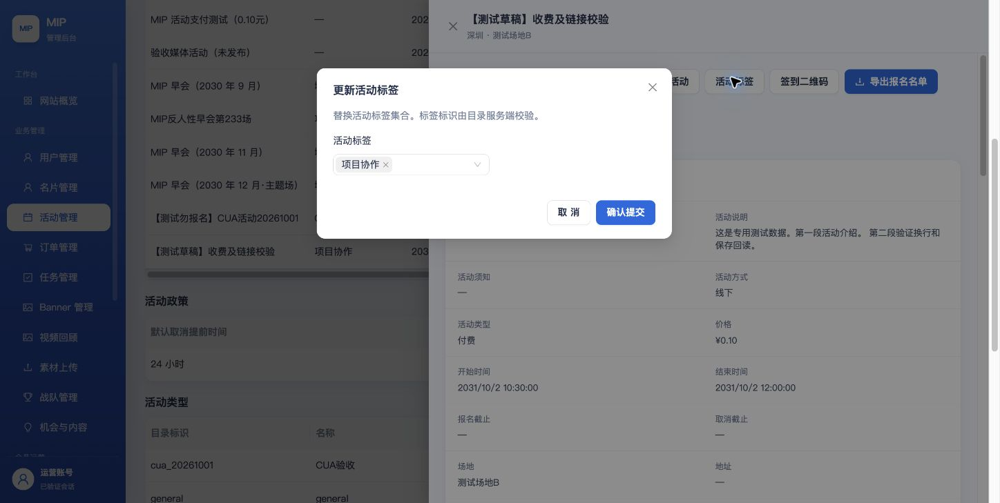
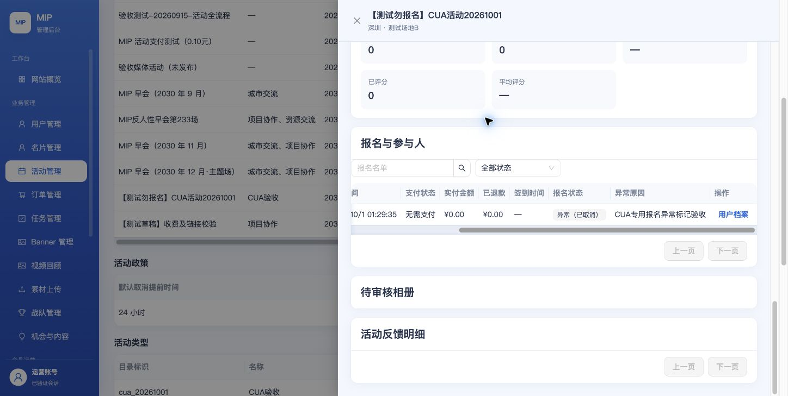
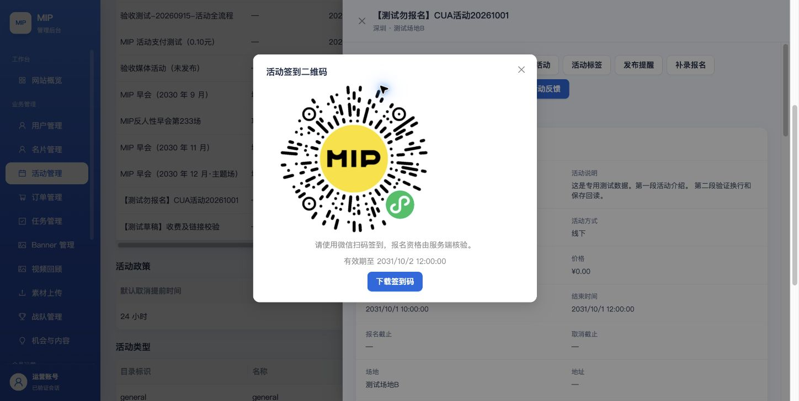
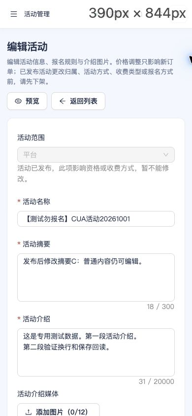

# 2026-10-01 活动后台 Computer Use 验收记录

本轮按 [后台唯一验收标准](../../../../admin-web/ACCEPTANCE.md) 的 E01–E09 和 G01–G08 执行，使用 Chrome 真实公开后台、既有 QA 登录态和非空 CloudBase staging 数据。主要操作通过 Computer Use 点击、键盘输入、文件选择与下载完成；没有用直接调用接口代替浏览器提交。上传失败另用受控 HTTP 请求诊断网关原因；云端部署另用官方 SCF SDK 回读。

这是逐项执行证据，不是另一套验收标准，也不声明整个后台或 E01–E09 全部通过。支付模式为 TEST，本轮没有付款、退款、群发、授权新账号或修改其他活动。

## 本轮修复

| 问题 | 实际原因与修复 | 回归证据 |
| --- | --- | --- |
| 113KB、926KB 图片上传失败 | CloudBase JSON 请求上限 100KB；上传改为有界二进制传输，仍保留身份、用途、内容校验和图片大小限制。[官方错误说明](https://docs.cloudbase.net/error-code/EXCEED_MAX_PAYLOAD_SIZE) | 115994 字节图片通过公开后台上传，保存封面 v7，刷新有图；移除并保存 v8，重新进入无图 |
| 签到码打开空白页 | 原实现把服务端图片 data URL 当网页打开；改为本场图片弹窗和下载，校验事件 ID、图片类型和大小 | 同场 JPEG 在弹窗实际加载，下载 96602 字节有效 JPEG；不再打开空白标签页 |
| 撤销补签后仍显示可提交反馈 1 人 | 反馈资格聚合缺少有效签到与有效报名双重条件 | 自有报名补签后 1，撤销后 0；实际 SQL 回归覆盖撤销、取消和跨用户记录 |
| 异常报名不能继续合法操作、原因不可见 | 异常标记覆盖了原始报名状态；操作改按可信原状态投影，并显示异常原因 | 异常（已报名）→异常（已签到）→异常（已报名）→异常（已取消），原因始终保留 |
| 日期按 Enter 意外提交整份表单 | 日期控件未阻止原生表单默认提交 | 最新公开编辑页按 Enter 保持编辑路由；只有点击确认提交才保存 10:30 时间 |
| 快捷标签编辑要求技术 ID，旧标签和版本未回填 | 改为具名多选，绑定可信详情版本并回填旧标签；操作入口按目录管理权限判断 | 选择项目协作并确认保存 v3，再次打开自动选中；没有 ID/版本输入框 |
| 线下活动显示会被清空的线上地址，预览误称场地链接 | 服务端线下模式不保存线上地址；编辑和预览只在 ONLINE/HYBRID 显示线上链接 | 最终公开版本：HYBRID 回填 HTTPS，切换 OFFLINE 字段消失、预览链接数 0；取消临时切换无写入，另有预览回归测试 |

## 已通过的浏览器步骤

| 场景 | 本轮实际操作与结果 | 尚不能外推的部分 |
| --- | --- | --- |
| G01/A01 | 既有 QA 密码登录、刷新后恢复真实会话，非空列表与详情加载 | 微信确认登录、首次设置/忘记密码、全角色撤权不在本轮 |
| E01/G04 | 非空活动按开始时间排序；价格 0.1–0.1 得到 2 场；2030-09-01 至 10-01 得到 9 月场；项目协作筛选 3 场，叠加广州得到空态；清除恢复列表 | 超过 20 条的跨页、全部服务器角色范围仍待验证 |
| E01/G06 | 创建专用标签、启用、活动绑定、停用；停用后旧活动保留 CUA验收，新选项不包含它；超过 5 字名称被拦截 | 没有更改既有正式标签；目录全部并发边界未在浏览器遍历 |
| E02/G02 | 必填名称、摘要、介绍、时间及缺地点校验；私有草稿保存、刷新恢复；新建对外 DRAFT；编辑多段介绍和地点、清空地址/须知后回读 | 独立场地 H5 尚缺实现，不能用线上地址代替 |
| E02/C03 | 真实封面上传、保存、重新打开预览、移除、重新保存回读 | 正文多张图片及全部用途媒体分支未在本轮遍历 |
| E02/G02 | 付费 0 被拦截；0.10 元草稿保存并显示 ¥0.10，仍无订单；HYBRID 下 HTTP/空链接被拦截，HTTPS 保存后再次编辑准确回填 | 这里只验证价格和链接配置，没有真实支付或链接目标可用性证明 |
| E02/G07 | 实际 1440×900、1280×720、390×844 编辑页；页面宽度分别等于对应视口宽，无横向页面溢出，390 下折叠导航与单列重排 | 所有页面、错误态和权限态未因此自动通过 G07 |
| E03 | 手机预览显示介绍、地点、价格、名额和报名字段，预览不可报名/支付，返回保持输入 | 发布后小程序同一活动对照仍待真机 |
| E04 | 发布确认取消无写入；DRAFT→PUBLISHED；发布后普通摘要可保存，影响资格/收费方式的字段有保护理由；下架→重新发布；最终结束 v10 | 活动取消、全角色及小程序前台一致性仍待验证；已结束不可重新发布是现行活动规则 |
| E05 | 克隆为私有草稿 7，标题和所有时间清空，场地/介绍/报名字段/相册等带入，原活动未改变 | 复制后的完整重新预览发布和微信端旅程仍待验证 |
| E06 | 真实 5 人历史名单；支付等待与已支付状态分开，旧订单 ¥399 快照不随新活动价 0.10 改写；名单搜索林夏得 1 人，跳用户档案、跳匹配订单 | 审核批准/拒绝、候补转正、全部角色和跨页名单仍待验证 |
| E06 | 自有活动补录实际合格用户→免费已报名，无支付单；不合格样例被 REGISTRATION_INELIGIBLE 拒绝且人数不增 | 没有伪造手机号、资格或用户协议；用户端主动报名和修改字段仍待微信端 |
| E06/E08 | 自有报名补签、撤销、标异常、再次补签/撤销、取消，均有原因及版本回读；取消后有效报名/签到/反馈资格均为 0，无订单 | 真机扫码资格、过期、重复及用户端取消仍待验证 |
| E06/E07/G04 | 真实下载并解析非空名单 XLSX 1 行（匹配搜索）和反馈 XLSX 1 行；名单包含原始报名状态、异常原因、支付状态与元单位，反馈包含完整答案；没有手机号列 | 跨页导出、全角色敏感字段范围仍待验证；没有在微信端新提交反馈 |
| E08 | 本场签到码实际图片加载与下载，JPEG 文件签名正确 | 静态码图和有效图片不等于真实扫码成功 |
| E09 | 专用活动有效报名、签到率与反馈资格随真实补签/撤销/取消同步变化 | 访问/分享/邀请/心动下钻与统计定义 Q-ADMIN-04 尚未收口；未追踪指标不能当作已验证 0 |

## 测试数据收尾

- 主活动 `0aee9202-1804-4945-ac6f-730952a82146`，名称 `【测试勿报名】CUA活动20261001`：最终 ENDED，版本 10；停止报名，保留历史。
- 自有报名 `437df5a2-fe52-495e-b6b9-94488917ae63`：最终原始状态 CANCELLED，版本 7；异常原因保留，有效报名/签到/反馈资格 0，无订单。
- 第二活动 `01ed9a59-ae75-466c-9e8b-0fb20d40eac5`，名称 `【测试草稿】收费及链接校验`：保留未发布 DRAFT，HYBRID/PAID ¥0.10；无报名、无订单，线上地址是明确测试用 `https://example.com/venue`。它由修复前日期 Enter 意外提交产生，之后用作收费与链接校验对象。
- 专用目录 key `cua_20261001` 的 TAG/TYPE 均停用；TAG 保留历史使用，TYPE 使用数 0。首次目录选择受弹窗渲染时序影响误创建 TYPE，随后创建正确 TAG；未改动正式目录。
- 私有复制草稿 7 保留，未独立发布；没有物理删除活动、报名或审计记录。

旧 `MIP 城市互动交流会` 样例存在 5 条 ATTENDED 与 4 条真实签到不一致、已有反馈但当前资格为 0 的历史数据。来源是旧 owner fixture 把报名直接写为 ATTENDED 却未补相应签到事实。没有改写该活动或虚构历史签到；本轮自有活动闭环统计正常。这是历史样例数据缺口，不是已被本轮证明修复的所有历史统计。

## 工程和发布证据

源码、代码包 SHA、环境和公开文件回读以 [release.public.json](release.public.json) 为准。完整检查以 [checks.public.json](checks.public.json) 为准，源码 CI 的两个 job 均成功，见 [ci.public.json](ci.public.json)；源修复分为 `4c6026d1`、`6f8aaa5a` 和 `c9b8047f`。仅更新既有 `mip-admin-api` 与 `mip-admin-web-api`，保留网关 `/`、`/api`、`/assets` 指向 BFF 的既有静态回退方式，未改 DNS、权限、VPC、计时器或支付模式。部署状态查询曾遇到腾讯云 TLS 中断，先只读回查再确认代码包，不以重试写入冒充成功。

原始下载包含用户样例信息，保留在本机 Downloads，不提交其内容；只记录文件名、行数、字段检查和 SHA：

| 文件 | 字节 / 行数 | SHA256 |
| --- | --- | --- |
| mip-event-roster-20260930T172536792Z.xlsx | 2384 / 1 | 7f74f2180908cf6e982fa23a555fc7402d095fa4642e851782d42dab9947de88 |
| mip-event-feedback-20260930T172447343Z.xlsx | 2480 / 1 | 8d73db3966ab871b9e1252e5a560262002d2686afdd11e97467666fa270d583a |
| 活动签到码-0aee9202-1804-4945-ac6f-730952a82146.jpg | 96602 / 有效 JPEG | 0a3140a224baa42751bf9a1717ed60f2e01f3539131de7548b6f44f9b1242f9f |

独立场地 H5 是 E02 的已确认缺项，因此矩阵将 E02 记录为失败；其余未执行完整的分支继续保留待验证，不用本轮局部通过覆盖整条状态。

## 用户接下来需要验什么

浏览器已通过的步骤无需为技术证明再全部重复；可以任选“草稿编辑/预览、标签修改、名单搜索导出”体验操作是否顺手。必须补证的是：

1. 微信真机同一专用活动：查看发布内容、用户报名/报名信息修改/取消、报名后扫码、无资格拒绝、重复和过期扫码、时间记录。
2. 专用收费活动：真实支付、失败/重复回调与报名状态、符合资格的退款及订单/报名联动；当前 TEST 与表单价格回读不能替代。
3. 城市/运营/无权账号的作用范围、撤权旧会话、审核与候补分支、超过一页的筛选导出。
4. 独立场地 H5 和 E09 正式指标定义/下钻，按原有 Q-ADMIN-04 及产品标准继续补齐。

最终公开页的状态、视口与追加回归读值见 [browser.public.json](browser.public.json)。

## 实拍

