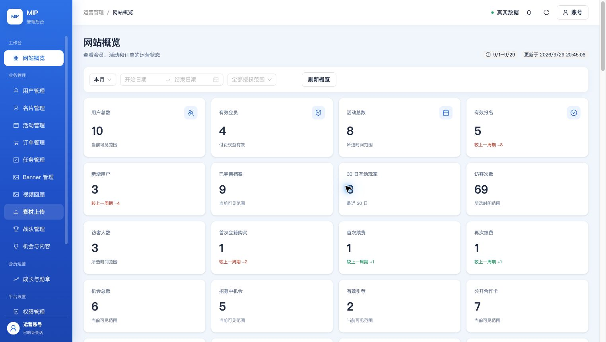
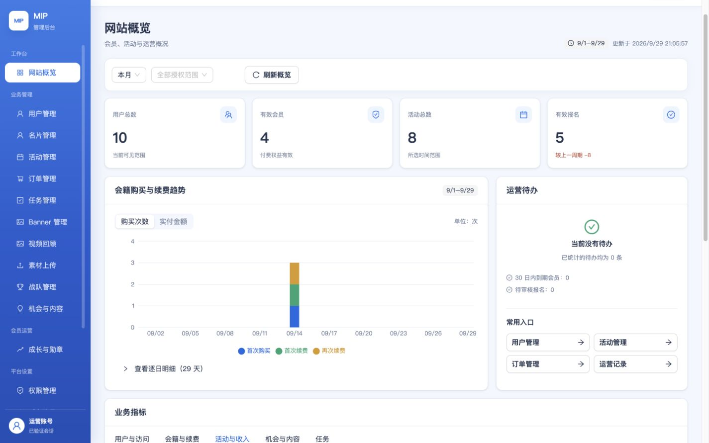
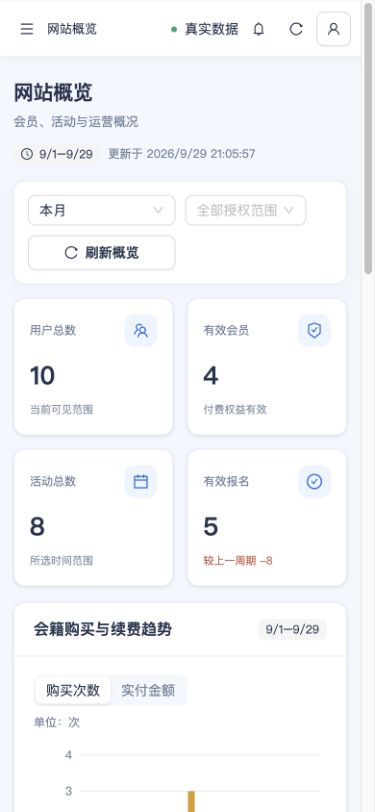

# 概览改版与机会恢复招募（2026-09-29）

产品验收仍只有 [admin-web/ACCEPTANCE.md](../../../../admin-web/ACCEPTANCE.md) 一套标准；本目录记录本次增量证据，不创建第二套验收表。

## 用户决定与业务建议

Q-ADMIN-01 已确认：下架可恢复，结束可重新招募。授权运营可编辑内容与截止时间，复用原机会，保留引荐、组队和审计历史；内容安全通过且未过期才允许恢复，归档/删除不在范围内。服务端保留版本冲突和权限检查。对应 O03 解除业务待确认，但完整角色和小程序流程仍待验证。

Q-ADMIN-02～09 仍待确认；完整建议只维护在 [REQUIREMENTS.md](../../REQUIREMENTS.md#管理后台来源冲突与未决项)。活动退款推荐沿用已有截止时间、首期默认开始前 24 小时，平台取消全额原路退；会费误扣、重复扣款、未履约及活动开始/签到后的例外由超管处理并留审计。建议尚未变成线上退款政策，本次没有执行退款。

## 界面问题与改法

改前实拍显示 25 个同级大指标卡，逐日表格默认展开，最近动态多达 20 条，未提供玩家趋势还占用整块卡片。阅读顺序和运营处理入口不清晰。

改后首屏只保留四个关键指标；会籍购买/续费改为可切换购买次数和实付金额的真实图表，右侧放待办与常用入口。其余 21 个指标归入五组，逐日明细折叠，最近动态默认六条。玩家增长缺少数据时只提示事实；刷新失败保留上次成功内容和重试入口。手机显示两列指标，筛选和图表适配窄屏。

图表与表格共享同一服务端响应，金额只从分转换到元一次。没有补造增长序列、变更统计口径或在客户端推断权限。图表按需加载，视觉沿用现有 Ant Design token。

| 证据 | 状态 |
| --- | --- |
| 完整 `pnpm verify:all` | 通过；根工程 1484 项，Web 合同 223 项，React 20 文件 / 127 项；服务端测试、lint、类型、构建和响应式合同通过 |
| 恢复、重新招募、安全检查和旧版本冲突专项测试 | 通过，23 项；验证原关联不被重建、结束标记清除、历史审计保留 |
| 本地真实数据预览 | 通过；只读代理现有 staging API，非模拟数据；桌面/手机无根节点横向溢出，次数/金额切换、展开逐日明细、业务指标切换通过 |
| 云端部署、真实 HTTPS、演示机会状态回读 | 待执行；发布后的摘要将保存在本目录 |
| 产品完整验收 | 未全部通过；53 场景中 17 项仍受 Q-ADMIN-02～09 影响，真机支付/手机号/签到仍需对应环境验收 |

构建仍有既有 Ant Design bundle 大小提示，不是检查失败。

## 实拍

改前 1280×720（已部署页面）：

改后本地 1440×900（真实 staging 数据）：

改后本地 390×844（真实 staging 数据）：

运行时输入、会话和原始响应只放在忽略的 `.tmp/admin-overview-20260929/`，本目录只保留无凭证、无个人联系方式的摘要与实拍。
