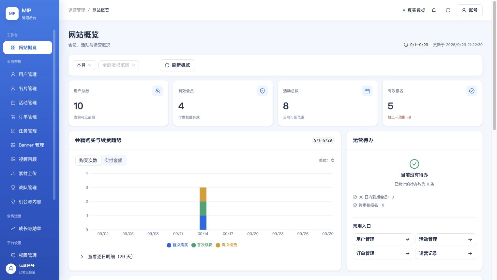
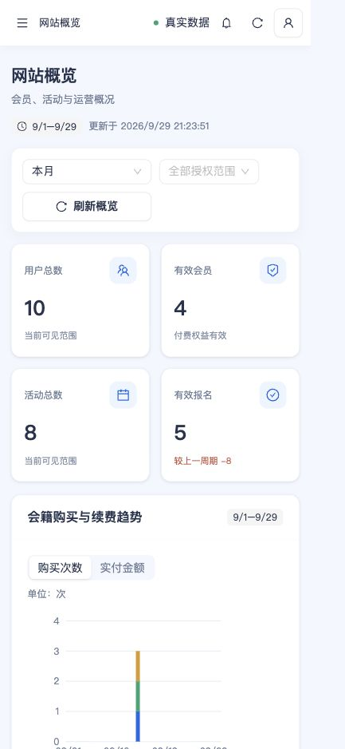
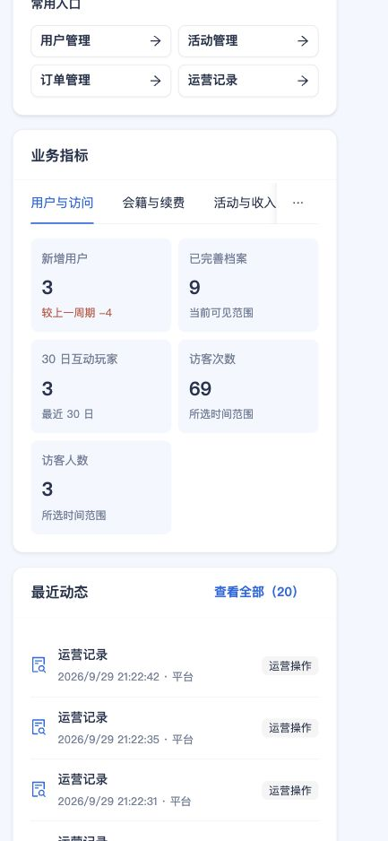

# 概览改版与机会恢复招募（2026-09-29）

产品验收仍只有 [admin-web/ACCEPTANCE.md](../../../../admin-web/ACCEPTANCE.md) 一套标准；本目录记录本次增量证据，不创建第二套验收表。

## 用户决定与业务建议

Q-ADMIN-01 已确认：下架可恢复，结束可重新招募。授权运营可编辑内容与截止时间，复用原机会，保留引荐、组队和审计历史；内容安全通过且未过期才允许恢复，归档/删除不在范围内。服务端保留版本冲突和权限检查。对应 O03 解除业务待确认，但完整角色和小程序流程仍待验证。

Q-ADMIN-02～09 仍待确认；完整建议只维护在 [REQUIREMENTS.md](../../REQUIREMENTS.md#管理后台来源冲突与未决项)。活动退款推荐沿用已有截止时间、首期默认开始前 24 小时，平台取消全额原路退；会费误扣、重复扣款、未履约及活动开始/签到后的例外由超管处理并留审计。建议尚未变成线上退款政策，本次没有执行退款。

## 界面问题与改法

改前实拍显示 25 个同级大指标卡，逐日表格默认展开，最近动态多达 20 条，未提供玩家趋势还占用整块卡片。阅读顺序和运营处理入口不清晰。

改后首屏只保留四个关键指标；会籍购买/续费改为可切换购买次数和实付金额的真实图表，右侧放待办与常用入口。其余 21 个指标归入五组，逐日明细折叠，最近动态默认六条。玩家增长缺少数据时只提示事实；刷新失败保留上次成功内容和重试入口。手机显示两列指标，筛选和图表适配窄屏。

图表与表格共享同一服务端响应，金额只从分转换到元一次。已修正单日区间错误显示到次日的问题，活动总数标明当前可见范围；没有补造增长序列、变更统计口径或在客户端推断权限。图表按需加载，视觉沿用现有 Ant Design token。

| 证据 | 状态 |
| --- | --- |
| 完整 `pnpm verify:all` | 通过；根工程 1484 项，Web 合同 223 项，React 20 文件 / 129 项；服务端测试、lint、类型、构建和响应式合同通过；编辑 SQL 收尾后根工程另行重跑 |
| 恢复、重新招募、安全检查和旧版本冲突专项测试 | 通过，24 项；验证原关联不被重建、结束标记清除、历史审计保留 |
| 本地真实数据预览 | 通过；只读代理现有 staging API，非模拟数据；桌面/手机无根节点横向溢出，次数/金额切换、展开逐日明细、业务指标切换通过 |
| 最终 CloudBase staging 部署 | 前端、BFF、`mip-admin-api` 已发布；源代码 `3e6292c3936de85ad51115cb044fea9563c731d6`，CI 36574337283 成功。静态入口 `index-7y2SrvN2.js`，真实 HTTPS 66/66、14 个读模块通过；下载云函数的 274 个 JS 与本地一致，MySQL 健康通过。见 [发布摘要](release.public.json) |
| 已部署演示机会状态与编辑回读 | 14/14 通过：结束/下架后的编辑、修改截止时间保存与回读、重新招募/恢复、旧版本拒绝、原内容和关联保留、前后状态审计；演示对象回到原发布状态且原截止时间恢复。见 [状态旅程摘要](opportunity-runtime.public.json) |
| 已部署概览浏览器验收 | CSS 视口 1440×900、1280×720、390×844 无根节点横向溢出；次数/金额切换、29 天逐日明细展开/折叠、业务指标 Tab 切换通过。单日自定义区间另有本地真实数据交互及回归测试，未单独声称线上自定义区间旅程通过。见 [浏览器摘要](browser-runtime.public.json) |
| 产品完整验收 | 未全部通过；53 场景中 17 项仍受 Q-ADMIN-02～09 影响，真机支付/手机号/签到仍需对应环境验收 |

构建仍有既有 Ant Design bundle 大小提示，不是检查失败。

发布脚本的首次云函数下载回读遇到 `MCP_READ_ERROR`，原始报告保留该失败。随后使用同一目标和本机已有授权独立重试，下载代码及健康回读通过；最终结论以发布摘要中的独立回读时间为准。没有扩权限、改 DNS、安装高频定时器或执行真实退款。当前目标是既有 staging，支付仍为 TEST。

## 实拍

改前已部署页面（默认桌面窗口；此实拍不是 1280×720）：

改后已部署页面（默认桌面窗口）：

改后已部署页面（实际 CSS 视口 390×844）：

手机下方业务指标和最近动态：

其余实拍：[已部署 1440×900](03-overview-live-1440.jpg)、[已部署 1280×720](04-overview-live-1280.jpg)、[本地 1440×900](02-overview-local-1440.jpg)、[本地手机](02-overview-local-mobile-final.jpg)。站点原有缩放为 90%，截图像素与 CSS 视口可不同；视口值来自 DOM 回读，临时视口覆盖已复原。

运行时输入、会话和原始响应只放在忽略的 `.tmp/admin-overview-20260929/`，本目录只保留无凭证、无个人联系方式的摘要与实拍。
