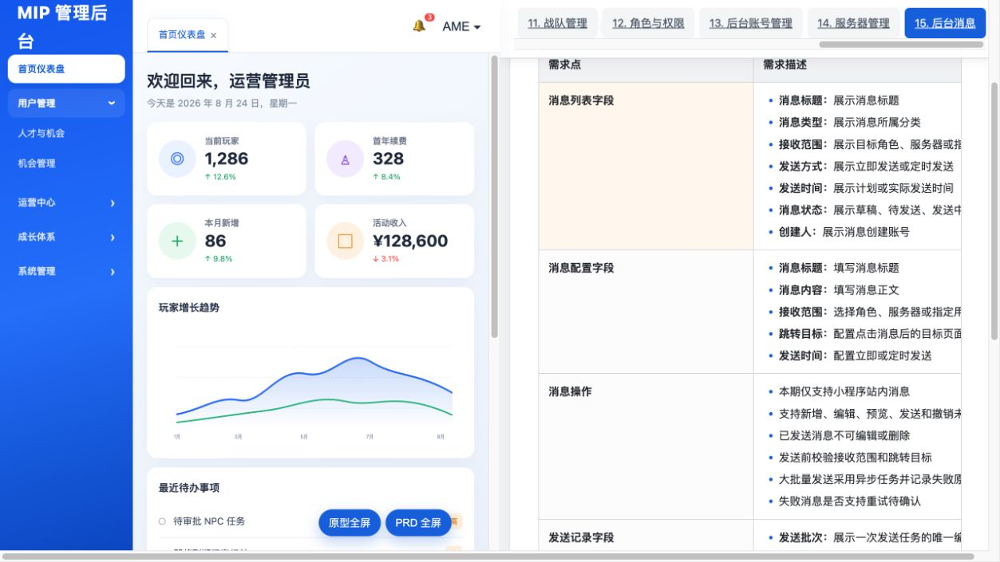
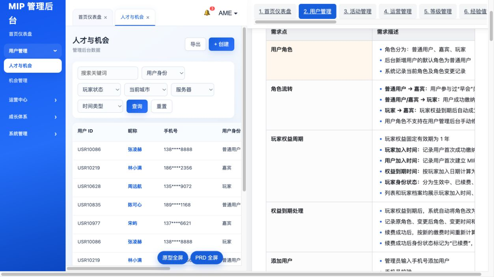
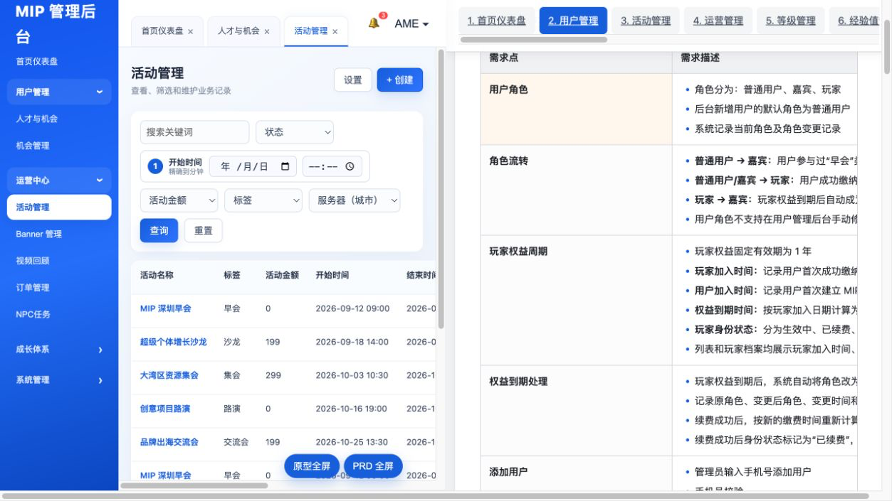

# 网页后台原型审计

来源：[MIP 小程序后台管理系统 PRD V0.4](https://bfd568111f4249be9902eba8e876cece.app.workbuddy.link/#messages)。审计日期：2026-08-25。

## 范围

页面包含一个可交互的蓝白后台原型和一份并排 PRD，共 15 个模块、108 个一级需求点：

1. 首页仪表盘
2. 用户管理
3. 活动管理
4. 运营管理
5. 等级管理
6. 经验值管理
7. 贡献值管理
8. 任务管理
9. 机会管理
10. 订单管理
11. 战队管理
12. 角色与权限
13. 后台账号管理
14. 服务器管理
15. 后台消息

## 截图步骤

### 1. 首页仪表盘

状态：原型可见。包含玩家、续费、新增、活动收入、趋势、待办、系统动态和快捷操作。演示数字没有指标口径，不能直接作为实现验收。

### 2. 用户管理

状态：原型可交互。包含身份、玩家状态、城市、服务器和时间筛选，以及脱敏手机号列表。原型同时使用普通用户、嘉宾、玩家三种身份，与当前 MIP 玩家/嘉宾模型冲突。

### 3. 活动管理

状态：原型可交互。包含状态、开始时间、金额、标签、服务器筛选，以及编辑和下载签到二维码。创建、预览、历史复制、报名、支付和统计的完整交互没有在本次截图中逐项验证。

## UX 与可访问性风险

- 原型与 PRD 各占一半视口，在常见笔记本宽度下，表格需要横向滚动，字段和操作容易被截断。
- 侧栏以“用户管理、运营中心、成长体系、系统管理”分组，但 PRD 顶部采用 15 个平铺模块，两套信息架构不完全一致。
- 用户列表演示数据中出现“普通用户 + 已续费”等互相矛盾状态，说明演示数据不能作为状态机依据。
- 主要表格需要验证键盘访问、表头语义、焦点、筛选标签、错误提示和窄屏降级；截图不能证明这些能力已经满足。
- “服务器”与“城市分会”、“用户身份”与“后台角色”容易混用，需要在实现前统一业务语言。

## 证据边界

- 本审计证明页面可访问，并检查了首页、用户列表和活动列表的可见状态。
- 没有验证全部按钮、表单提交、登录方式、权限矩阵、上传、导出、定时消息或浏览器兼容性。
- 页面标注“需求细化中”，所有待确认规则进入 [OPEN_QUESTIONS.md](../../OPEN_QUESTIONS.md)，不能依据原型自行补造。
